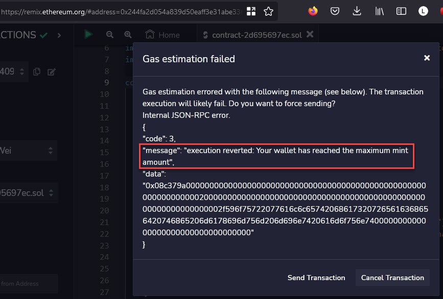

#  NFT Smart Contract (ERC721) - week 1

:book: [Alchemy University](https://docs.alchemy.com/docs/1-how-to-develop-an-nft-smart-contract-erc721-with-alchemy): How to Develop an NFT Smart Contract (ERC721) with Alchemy

#### Proof

:globe_with_meridians: [Deployed NFT Smart Contract](https://goerli.etherscan.io/address/0xb985b513ef1a2d545a1526bec9c48c7122d7115d)

:globe_with_meridians: [Contract code in Remix IDEA](https://remix.ethereum.org/address/0xb985b513ef1a2d545a1526bec9c48c7122d7115d)

:globe_with_meridians: [OpenSea NFT](https://testnets.opensea.io/assets/goerli/0x244fa2d054a839d50eaff3e31abe33681a327b4a/0)

Screenshot confirming the implemented require statement does not let a wallet mint more than the maximum amount specified.

#### Learned 

:globe_with_meridians: How to use [OpenZeppelin](https://docs.openzeppelin.com/contracts/4.x/wizard) contract wizard.

:globe_with_meridians: How to use [Remix](https://remix.ethereum.org) for online (browser) solidity smart contract development.

:globe_with_meridians: How to use [Alchemy](https://www.alchemy.com/) as an RPC provider to write and query the goerli testnet blockchain.

:globe_with_meridians: How to use [Filebase](https://www.filebase.com/) to host metadata on IPFS.

#### Social

:herb: [coding.lens](https://lenster.xyz/u/coding.lens) :herb: